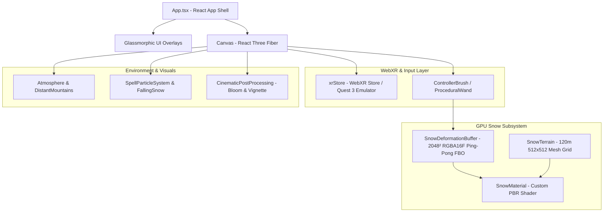

# SnowVR Architecture & Design Blueprint

This document defines the module boundaries, GPU dataflow pipeline, state management rules, and performance guidelines for **SnowVR**.

---

## 🏗️ System Architecture

---

## 📦 Core Module Boundaries

### 1. WebXR & Interaction Layer (`src/xr/`)
* **`store.ts`**: Manages WebXR session lifecycle using `@react-three/xr`. Configures dev-mode Quest 3 `IWER` emulator runtime.
* **`ProceduralWand.tsx`**: Maps input sources (VR 6DOF controllers or desktop mouse raycasts) into 3D world space. Emits brush position `(x, z, radius)` and 4-channel spell intensity parameters into `SnowDeformationBuffer`. Renders floating magic wand staff with dynamic SSS point light.

### 2. GPU Snow Simulation & Rendering (`src/snow/`)
* **`SnowDeformationBuffer.ts`**: Maintains two `WebGLRenderTarget` instances in `RGBA16F` half-float format. Executes a GLSL compute pass every frame to perform stamp blitting, slump diffusion, berm collapse, and wind refill decay.
* **`SnowMaterial.ts`**: Custom Three.js `ShaderMaterial` implementing:
  * GLSL Vertex Shader height displacement (natural sastrugi dune noise + FBO deformation map).
  * Central-difference normal calculations.
  * Subsurface scattering (SSS) backscatter with ice-blue depth tint (`#024773`).
  * GGX wet slush specular reflections.
  * 3D grazing-angle micro-crystal sparkles.
  * Horizon distance fog blending (`#2b5c7e`).
* **`SnowTerrain.tsx`**: Renders a 120m × 120m plane geometry with 512×512 vertex density.

### 3. Spell & Experiment Framework (`src/experiments/`)
* **`SpellManager.ts`**: Pluggable spell registry defining spell metadata, brush radius, depth, berm height, ice factor, wetness factor, and VFX type for Spells 1 through 5.

### 4. Environment & FX Layer (`src/environment/`)
* **`Atmosphere.tsx`**: Sky dome, directional sun shadows, and ambient sky lighting.
* **`DistantMountains.tsx`**: 360-degree procedural alpine mountain backdrop ring.
* **`FallingSnowParticles.tsx`**: 3,000 3D volumetric falling snowflakes.
* **`SpellParticleSystem.tsx`**: Dynamic water spray, steam haze, and frost crystal sparkles.
* **`CinematicPostProcessing.tsx`**: Post-processing stack featuring Bloom and Vignette.

---

## 💾 GPU FBO State Buffer Channel Map

The `SnowDeformationBuffer` ping-pongs two 2048×2048 `RGBA16F` targets (3.9 cm texels over 120 meters):

| Channel | Physical State | Range | Shader Behavior |
| :--- | :--- | :--- | :--- |
| **R** | Trench Depression Depth | `0.0 - 1.0` | Displaces vertex downward (-Y); increases SSS ice-blue depth tint. |
| **G** | Berm & Spire Height | `0.0 - 1.0` | Displaces vertex upward (+Y); builds Frost Spires and Vortex Mountains. |
| **B** | Ice Compression | `0.0 - 1.0` | Tints snow color toward ice-blue; lowers roughness for icy reflections. |
| **A** | Wetness / Slush | `0.0 - 1.0` | Lowers GGX roughness to 0.12; increases shiny specular reflections. |

---

## ⚡ Performance Guidelines for WebXR

To sustain **72 to 90 FPS** on standalone WebXR hardware (Meta Quest 3):

1. **Zero CPU Geometry Rebuilds:** Vertex displacement happens 100% inside `SnowMaterial` vertex shader. The CPU mesh buffer remains static.
2. **Ping-Pong RenderTarget FBO:** Simulation compute shader runs in one full-screen pass per frame (`2048×2048 RGBA16F`), avoiding memory reallocation.
3. **Instanced / Single-Draw Particles:** Particle systems use `THREE.Points` with single buffer attributes.
