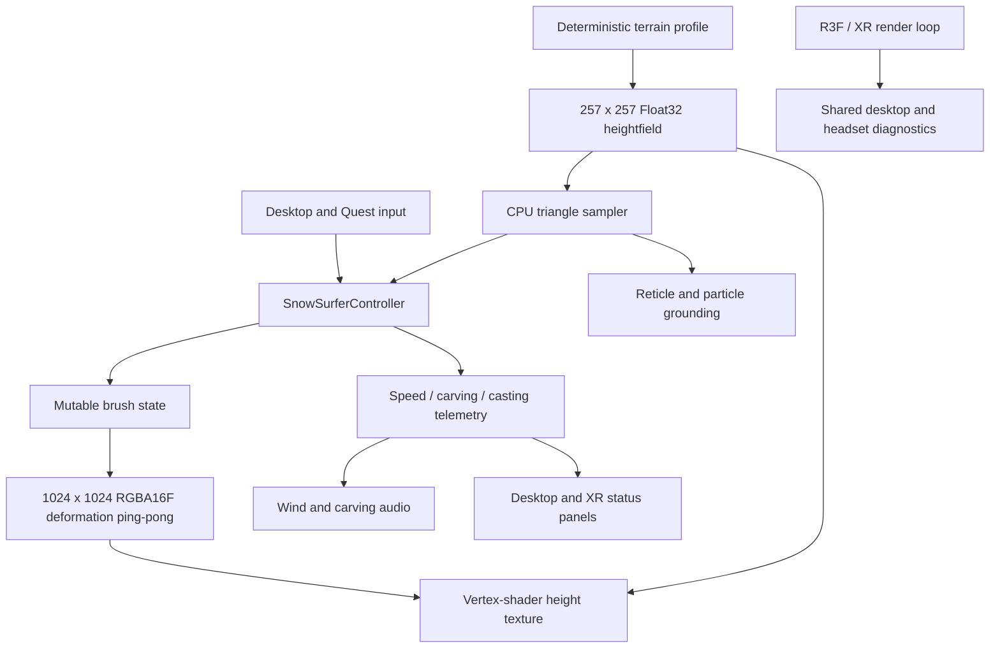

# SnowVR Architecture

SnowVR is a third-person WebXR downhill sandbox targeting Meta Quest 3 at 72 Hz. The runtime is split into input/locomotion, shared terrain and deformation, GPU particle effects, environment rendering, audio, and UI diagnostics.

## Runtime data flow

## WebXR and interaction

- `src/xr/store.ts` defines a deliberately small immersive-VR feature set. It disables unsolicited session offers and unused AR features, requests layers, sets fixed foveation to `0.5`, and selects 72 Hz when the runtime exposes it.
- Native WebXR always takes priority. The IWER Quest emulator is opt-in during development with `?emulate=1`; it is never force-installed over a connected headset.
- `SnowSurferController.tsx` owns rider position, velocity, heading, camera chase state, Quest controller sampling, desktop controls, spell aiming, and the endless-run transition.
- The loop transition fades a camera-following in-scene veil to full opacity before applying the same 80 m coordinate rebase to the rider and active camera rig. Velocity and heading are preserved.

## Terrain and deformation

- The base terrain is a deterministic 120 m square sampled into a 257 x 257 `Float32Array`, one height per vertex of a 256 x 256 segment `PlaneGeometry`.
- The GPU samples that array through a nearest-filtered float `DataTexture`. CPU grounding uses the same data and the exact two-triangle split used by Three.js `PlaneGeometry`, including the inverted world-Z/texture-V mapping.
- `SnowDeformationBuffer.ts` maintains two 1024 x 1024 `RGBA16F` render targets. Channels store depression, berm/spire height, ice, and wetness.
- Spell and carving stamps are normalized to a 72 Hz reference rate. Slump, wind refill, and drying use elapsed time.
- Dynamic deformation is currently visual-only. Rider physics, reticles, and particle emission are grounded to the shared base heightfield, not the deformation buffer.

## Effects, audio, and UI

- Spell VFX use a 64 x 64 GPGPU state texture: 4,096 particles with idle suspension. Spawn probability is converted from the 72 Hz reference probability to the current frame interval.
- Falling snow uses 1,200 CPU-updated points. Slalom poles are instanced.
- Audio consumes sampled rider speed and carving intensity rather than UI input state.
- The always-available XR status panel shows the active spell, rider speed, and CAST/READY state near the rider.
- `?dev=1` adds a head-following XR diagnostics panel. It and the DOM panel share render-loop measurements: FPS, average and p95 frame time, fixed foveation, XR refresh rate, and projection-layer dimensions.

## Performance budgets

| Resource | Current budget |
| --- | ---: |
| Terrain mesh | 256 x 256 segments (257 x 257 vertices) |
| Base heightfield | 257 x 257 R32F-equivalent data texture |
| Deformation state | 1024 x 1024 RGBA16F, ping-pong |
| Spell particles | 4,096 |
| Falling snow points | 1,200 |
| Quest target | 72 Hz, foveation 0.5 |

Run `npm run validate` before deployment. It performs the TypeScript check, unit tests, and the production Vite build.
